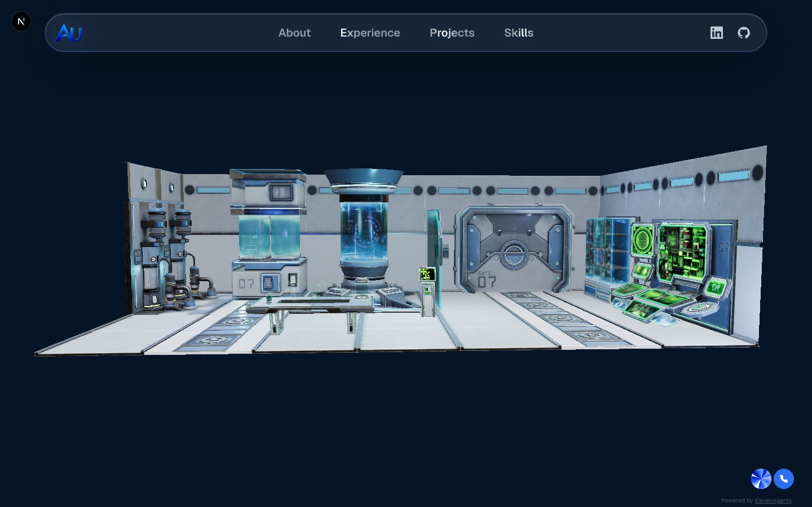

# Portfolio — azizu.dev

Personal portfolio site for **Aziz Umarov**, built with the Next.js App Router and a
heavy emphasis on motion and 3D. It presents work, experience, and skills through an
interactive WebGL hero, animated route transitions, and a conversational voice agent —
rather than a static résumé page.

🔗 **Live:** [azizu.dev](https://azizu.dev)

> This is `portfolio-v3`, the canonical version. Earlier iterations live in
> [`../../archive/portfolio-v1`](../../archive/portfolio-v1) and
> [`../../archive/portfolio-v2`](../../archive/portfolio-v2).

## Preview



> Home route (`/`) captured from the local dev server. A high-quality social preview
> also ships at [`public/og-image.jpg`](public/og-image.jpg).

## Features

- **3D hero stage** — a Three.js scene (`home-model-stage`, `hero-stage`) rendering a
  `sci-fi-lab` GLB model via React Three Fiber and `@react-three/drei`.
- **Voice agent** — an embedded ElevenLabs conversational widget
  (`elevenlabs-widget`) so visitors can talk to the portfolio instead of only reading it.
- **Animated routing** — page transitions and scroll-driven reveals using GSAP and
  Motion, with a custom liquid "pill" navigation bar.
- **Dedicated sections** — separate routes for Home, Projects, Experience, Skills, and
  About, each with its own motion treatment.
- **Project spotlight** — project cards with hover spotlight effects and per-project
  preview imagery/video, driven by structured data in `src/data/projects.ts`.
- **Skills orbit** — an orbiting visual showcase of tools and technologies.
- **Polished visual layer** — React Bits–style effects (Aurora, Iridescence, Electric
  Border, Split/Shiny text, circular gallery) adapted into the app.

## Tech stack

| Layer | Choices |
|---|---|
| Framework | Next.js 16 (App Router), React 19, TypeScript |
| 3D / WebGL | Three.js, `@react-three/fiber`, `@react-three/drei`, OGL |
| Animation | GSAP (`@gsap/react`), Motion |
| UI | Tailwind CSS v4, shadcn/ui, Base UI, `class-variance-authority`, Lucide icons |
| Voice | ElevenLabs conversational widget |
| Analytics | Vercel Analytics + Speed Insights |
| Hosting | Vercel |

## Getting started

**Prerequisites:** Node.js 24.x (see the `engines` field in `package.json`).

```bash
npm install
npm run dev
```

Open [http://localhost:3000](http://localhost:3000).

### Scripts

| Script | What it does |
|---|---|
| `npm run dev` | Start the Next.js dev server |
| `npm run build` | Production build |
| `npm run start` | Serve the production build |
| `npm run lint` | Run ESLint (`eslint-config-next`) |

### Generating project previews

Project cards play short screen-recordings (`public/assets/project-previews/<slug>.mp4`)
captured from each project's live deployment. They're produced by a Playwright script,
`.codex-project-preview-capture.spec.ts`, driven by `playwright.capture.config.ts`:

```bash
# record one project (writes <slug>-raw.webm + <slug>.png)
PROJECT_SLUG=<slug> npx playwright test --config=playwright.capture.config.ts

# convert the raw recording to the committed mp4 (H.264, 1440×810, 60fps)
ffmpeg -i public/assets/project-previews/<slug>-raw.webm \
  -vf "fps=60,format=yuv420p" -c:v libx264 -preset slow -crf 24 \
  -movflags +faststart -an public/assets/project-previews/<slug>.mp4
```

Render-hosted demos cold-start after inactivity, so warm the URL (e.g. `curl`) before
recording. Each capture entry lives in the spec's `projects` array.

## Environment variables

No server-side secrets are required to run the site locally — the source does not read
any `process.env.*` values, and the ElevenLabs widget uses a **public** client-side
agent ID embedded in `src/components/portfolio/elevenlabs-widget.tsx`. A local `.env`
file (gitignored) may exist for tooling but is not needed for `npm run dev`.

## Project structure

```
src/
├── app/                      # App Router routes
│   ├── page.tsx              # Home (3D hero)
│   ├── layout.tsx            # Root layout, metadata, fonts, voice widget
│   ├── projects/             # Projects route
│   ├── experience/           # Experience route
│   ├── skills/               # Skills route
│   ├── about/                # About route
│   ├── api/elevenlabs/       # Voice-agent endpoint scaffold
│   └── globals.css
├── components/
│   ├── portfolio/            # Page-level building blocks (hero, nav, spotlight, widget)
│   ├── ui/                   # shadcn/ui primitives (button, card, dialog, tabs…)
│   └── *.tsx                 # React Bits–style visual effects
├── data/
│   ├── projects.ts           # Project catalog (titles, descriptions, links, tech)
│   └── experience.ts         # Experience timeline data
└── lib/utils.ts
public/
├── models/sci-fi-lab-2k-web.glb   # 3D hero model
├── assets/                        # Project previews, logos, headshot, résumé
└── og-image.jpg                   # Social preview
```

## Technical highlights

- **Content as data, not markup.** Projects and experience are declared as typed arrays
  (`src/data/*.ts`), so adding work is a data edit, not a component rewrite — and the
  same `Project` type powers cards, spotlights, and preview media.
- **GLB on the web.** The hero loads a 2K, web-optimized `.glb` lab scene; keeping the
  model in `public/models/` and tuning it for the web is what keeps the 3D hero from
  tanking load time.
- **Restraint over spectacle.** Per the repo's own design guidance, motion and glass
  surfaces follow an Apple/macOS-style hierarchy rather than piling on effects.

> ⚠️ This repo pins **Next.js 16 / React 19**, whose APIs differ from older versions.
> See [`AGENTS.md`](AGENTS.md) before changing UI code.

## Roadmap / ideas

- Wire up the `api/elevenlabs/signed-url` route if the voice agent moves to a
  server-authenticated signed-URL flow.

## License

No license file is present; treat as **all rights reserved** unless a license is added.
